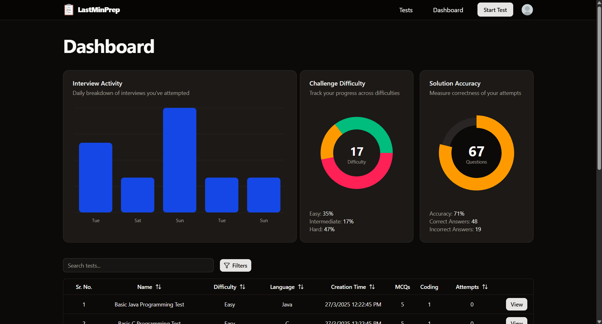
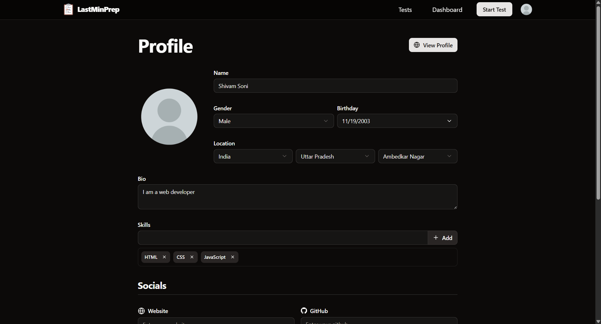

<div align="center">
  <a href="https://lastminprep.vercel.app">
    
  </a>

  <h1> LastMinPrep</h1>
  <p> 
  LastMinPrep is your ultimate AI-powered interview preparation platform, combining real-time analytics with tailored practice to help you ace your next opportunity.
  </p>
  <a href="https://lastminprep.vercel.app">
    
  </a>
</div>

## 📌 What is LastMinPrep?

LastMinPrep offers:

- ✅ **AI-Generated Questions**: Practice with automatically generated MCQs and coding questions designed to match your target roles.
- ✅ **Detailed Analytics**: Track your accuracy, consistency, and overall performance across practice sessions.
- ✅ **Profile Insights**: Share your unique preparation journey with others, including your personalized stats.
- ✅ **Smart Interview Prep**: You get personalized tips for every coding question you submit, helping you focus your efforts where they matter most.

---

## 🛠 Features

- 🧠 **MCQs & Coding Questions** – Covering a range of topics with varying difficulty.
- 📈 **Session Analytics** – Measure your progress with detailed performance graphs.
- 🔗 **Sharable Profiles** – Let recruiters or peers see your readiness.
- ⏱️ **Last-Minute Revision** – Quick drills designed for the final hours before your interviews.

---

## 🚦 Getting Started

1. **Sign up** at [lastminprep.vercel.app](https://lastminprep.vercel.app/auth/options)
2. Start a practice session by selecting your preferred topics and difficulty.
3. Answer MCQs or solve coding problems directly in the platform.
4. View analytics in your profile to monitor your accuracy, completion rates, and trends.
5. Share your profile link with friends or recruiters!

---

## 📚 Technologies Used

- 
- 
- 
- 
- 
- 
- 
- 
- 
- 
- 

---

## 🤝 Contributing

Contributions are welcome! Please open an issue or submit a pull request if you’d like to improve LastMinPrep.

---

Of course! Here’s an updated **Connect with Me** section you can use at the end of your README, phrased in a friendly but professional way so users know they can reach out directly to you:

---

## 🤝 Connect with Me

Got questions, feedback, or just want to chat about LastMinPrep? Feel free to reach out — I’d love to hear from you!

- 📧 **Email**: [legendshivam11@gmail.com](mailto:legendshivam11@gmail.com)
- 💼 **LinkedIn**: [linkedin.com/in/sethshivam11](https://linkedin.com/in/sethshivam11)
- 🐦 **Twitter/X**: [x.com/sethshivam11](https://x.com/sethshivam11)

---

## 🛠️ Installation

1. Clone the repo

```bash
git clone https://github.com/sethshivam11/lastminprep
```

2. Install the required NPM packages

```bash
npm install
```

3. Enter your environment variables in `.env.local`. Refer [.env.sample](https://github.com/sethshivam11/lastminprep/blob/main/.env.sample) for required variables.

4. Change git remote url to avoid accidental pushes to base project

```bash
git remote set-url origin github-username/repo-url
git remote -v # confirm the changes
```

---

## 📸 Screenshots

  <div>
    <div>
      <a href="https://lastminprep.vercel.app">
        
      </a>
    </div>
    <div>
      <a href="https://lastminprep.vercel.app/auth/options">
        
      </a>
    </div>
    <div>
      <a href="https://lastminprep.vercel.app/auth/sign-in">
        
      </a>
    </div>
    <div>
      <a href="https://lastminprep.vercel.app/auth/sign-up">
        
      </a>
    </div>
    <div>
      <a href="https://lastminprep.vercel.app/dashboard">
        
      </a>
    </div>
    <div>
      <a href="https://lastminprep.vercel.app/test/new">
        
      </a>
    </div>
    <div>
      
    </div>
    <div>
      
    </div>
    <div>
      <a href="https://lastminprep.vercel.app/profile">
        
      </a>
    </div>
    <div>
      
    </div>
    <div>
      <a href="https://lastminprep.vercel.app/usage">
        
      </a>
    </div>
    <div>
      <a href="https://lastminprep.vercel.app/tests">
        
      </a>
    </div>
    <div>
      
    </div>
  </div>
